# Lets-Meet-An-Ultimate-Guide-For-Meeting-Scheduling-and-Summarizing

Let's Look at the preview of our software:

1. Welcome Page:
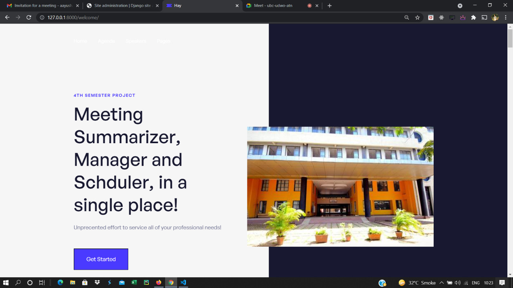

2. Login Page:
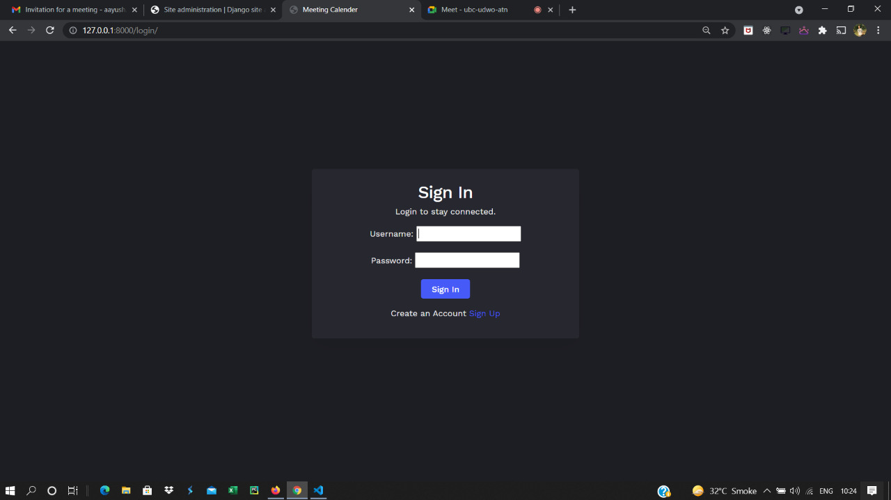

3. Register View:
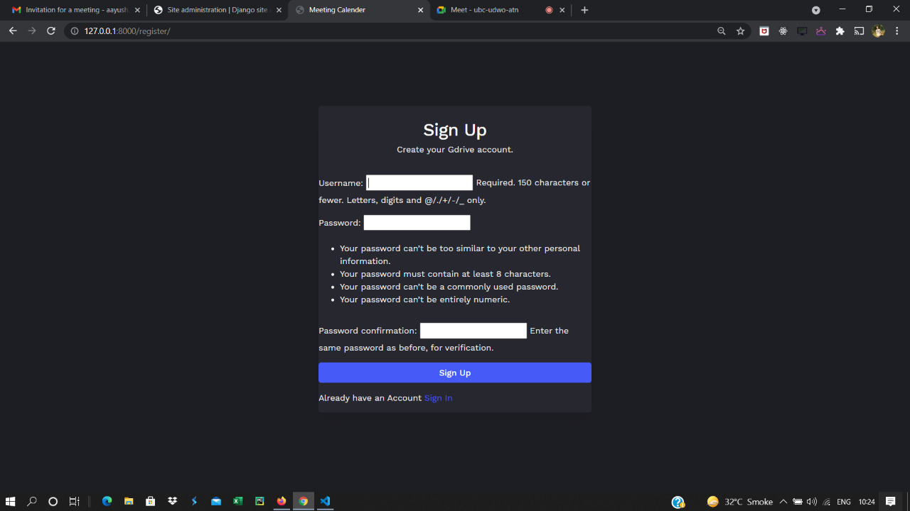

4. Dashboard:
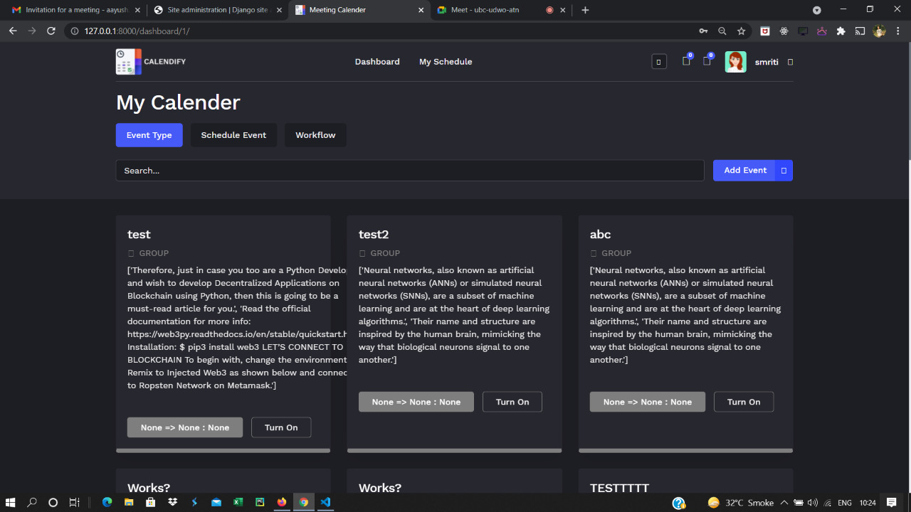

5. Schedule:
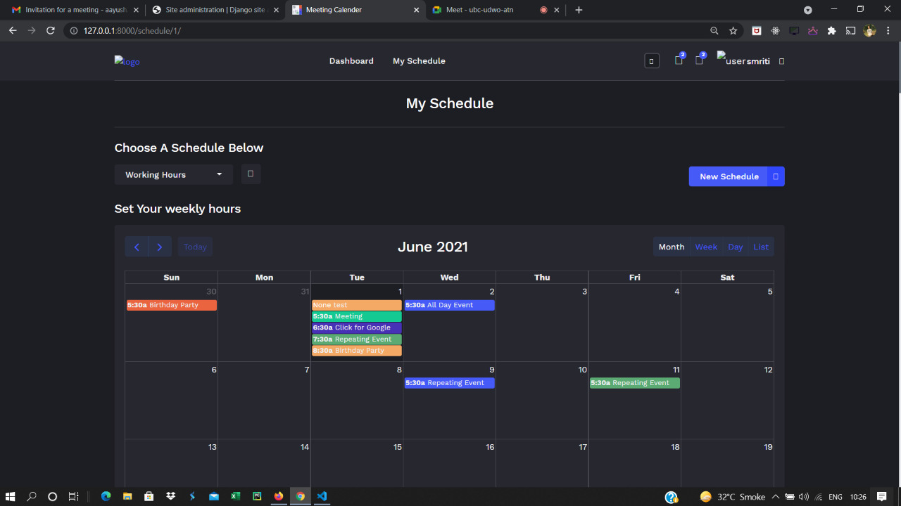

6. Scheduler Page:
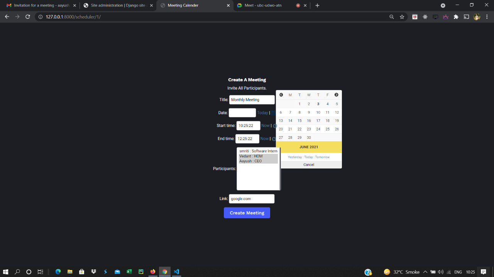

7. Email is sent to all invitees:
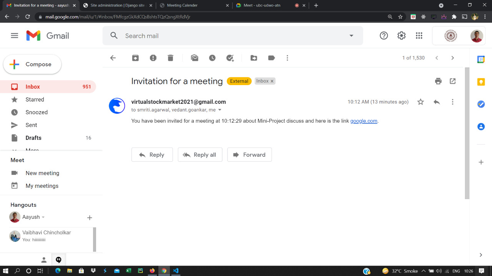

8. Speech to Transcript Page:
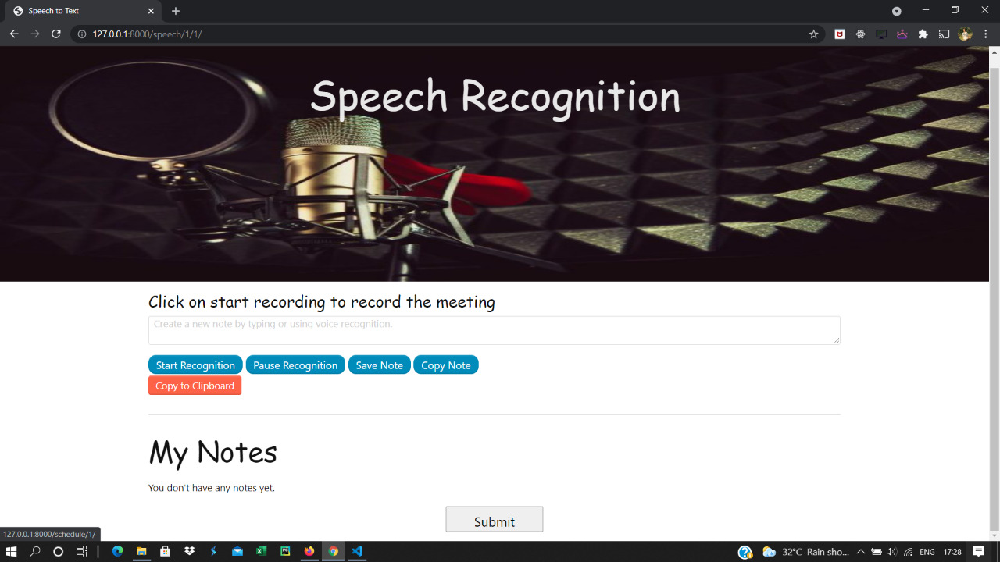

9. Paste your Input here:

10. Here is the generated summary and the wordcloud:
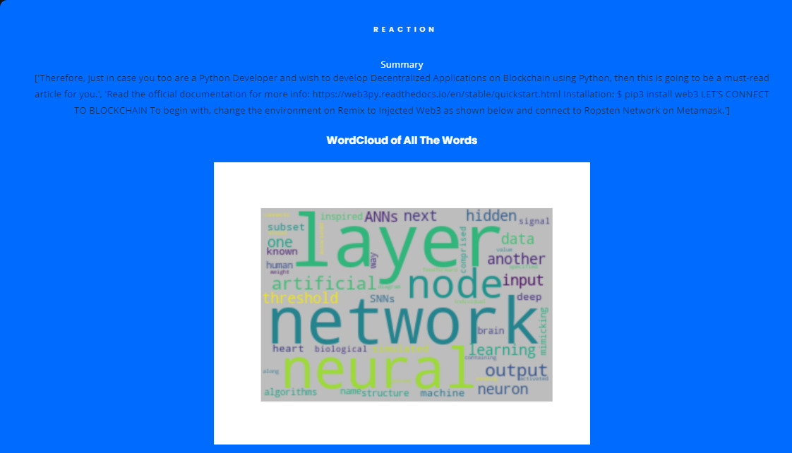

11. Histogram with rougue score:
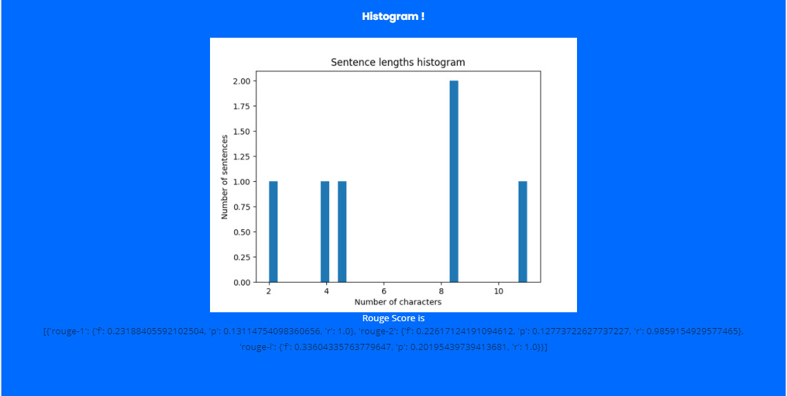

12. Bert Model Output:

13. Profile Page:
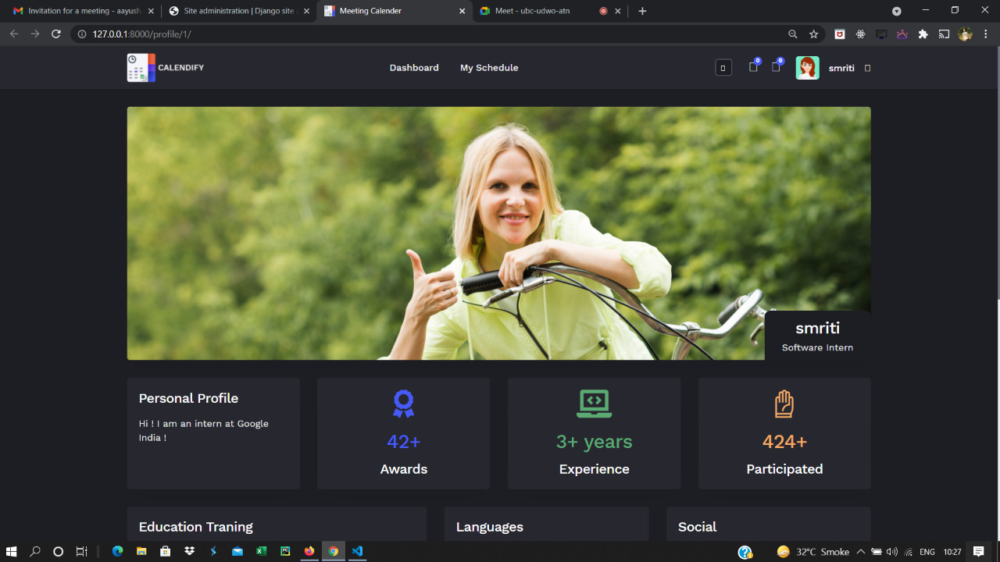

14. Django Admin Page:
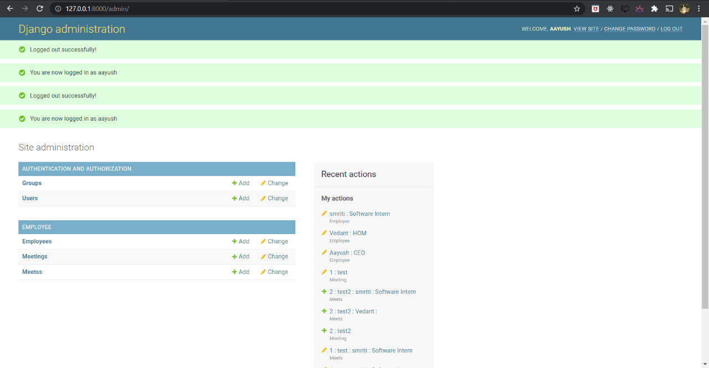

