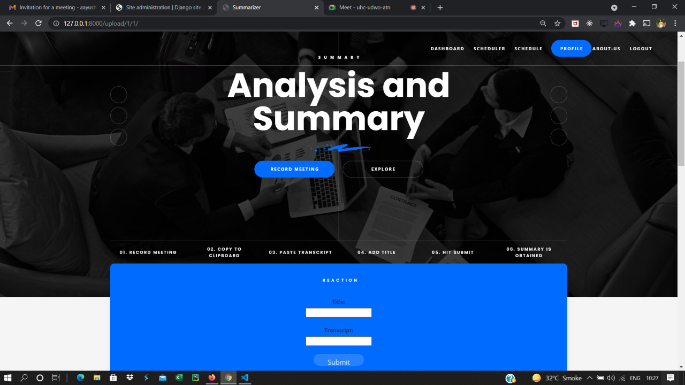
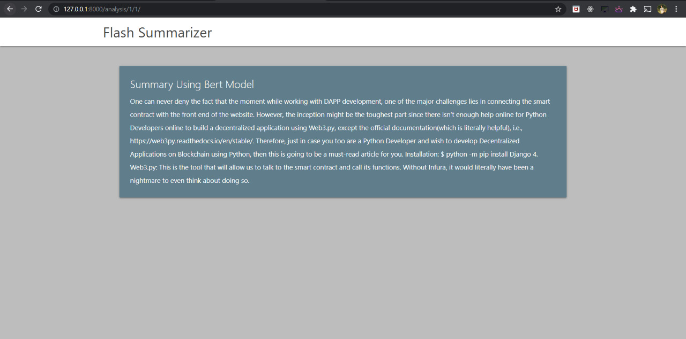

# Lets-Meet-An-Ultimate-Guide-For-Meeting-Scheduling-and-Summarizing
Let's Meet is an managment level software aimed to solve every problem related to online meetings ranging from scheduling the meet, to notification to participants and even summarizing the meeting.
According to our survey, employees have to waste a lot of time taking minutes during a meeting, our meeting summarizer to the resque.
If you are one of those employees then Let's Meet is for you, here are some points that make us the best alternate available in the market:
  We convert meeting audio to transcript on our webpage itself.
  We use broad pre-prossesing of data to reduce noice in the transcript generated.
  Our NLP module uses 4 different algorithums to provide you with the best summary in the least possible time.
  We also provide an wordcloud and an histogram to help get a better idea about the meetings topic.
  We also provide a much deeper summary of the meeting which takes a bit more time than ususal using the Bert Model.
  
Also we reduce the unnecessary friction caused during meeting scheduling during the work from home period, wanna know how:
  Our software allows every single person from your organization to register.
  Any indivisual can create a meeting and invite any number of people from the organization for the same.
  All the invities will recieve an email notification for the same with topic of the meeting, the start time ,end time and the link.
  Any attendee can use our software to summarize the meeting and the summary gets added to the meetings of all the attendee's dashboard.

I hope we can solve all your meeting related issues 
Now let's have a look at the tech stack we use:
  Django Framework 3.1.4
  Html, CSS and Javacript
  Web Speech to Text Conversion - webkit, vanilla js 
  nltk library 3.5
  numpy 1.20.2
  networkx 2.5
  wordcloud 1.8.1
  rouge model 1.0.0
  pillow 8.2.0
  Matplotlib 3.4.1
  summarizer 0.0.7
  DB SQLite3
  
We use the following techniques for pre-processing:
  Case Folding
  Removal of stop words
  Tokenization
  Stemming
  
Let's also look at the model we work with during the extractive phase for generating a meeting summary:
  Term Frequency Distribution
  Term Frequence-Inverse Document Frequency
  Cosine Distance
  Pagerank
We standardise the output of each algorithum and supply it to the next algorithum to produce a summary of the whole meeting. 
We later use Rouge to compare our summary with industry standards

Let's Look at the preview of our software:

1. Welcome Page:

2. Login Page:

3. Register View:

4. Dashboard:

5. Schedule:

6. Scheduler Page:

7. Email is sent to all invitees:

8. Speech to Transcript Page:

9. Paste your Input here:

10. Here is the generated summary and the wordcloud:

11. Histogram with rougue score:

12. Bert Model Output:

13. Profile Page:

14. Django Admin Page:

